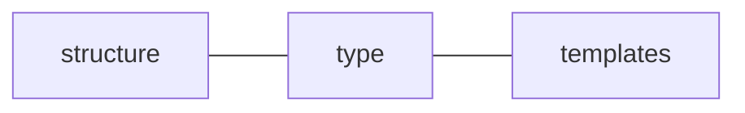

# Library Genesis

> The purpose of library-genesis is to make it easy to convert a single config into a scaffolded project. This is more fluid than cloning.

<!-- TOC START min:1 max:5 link:true update:true -->

* [Library Genesis](#library-genesis)
  * [Brainstorm](#brainstorm)
    * [Dependencies](#dependencies)
    * [Config File](#config-file)
    * [Questions](#questions)
      * [Topology](#topology) & [Structure](#structure)
      * [Type](#types)
      * [Templates](#templates)
      * [Config files](#config-files)
    * [Config Files](#config-files)
      * [Copying](#copying)
      * [Creating](#creating)
        * [Topology](#topology)
        * [Structure](#structure)
        * [Types](#types)
    * [Templates](#templates)

<!-- TOC END -->

---

## Brainstorm

---

### Dependencies


### Config File



* `Structure`
  > How everything is laid out
* `Type` (ie. directory, plain, symlink, template)
  > Will symlinking present any race case issues ?
* `Templates`
  > Files which are being duplicated with interpolated values

---

### Questions

---

##### [Topology](#topology) & [Structure](#structure)

* This is the essence of the config. This structure itself should be fairly straightforward.
* What's the best way to reference templates (templatePath, templateVariables)?

##### [Type](#types)

* How should types be specified?
* What are the attributes of those types?

##### [Templates](#templates)

* _Q:_ How should they be `defined`? (A: see content-genesis for reference)
* _Q:_ Where should they be `stored`?
* _Q:_ How should they be `shared`?
* _Q:_ How should they be `classified`?

##### [Config files](#config-files)

* _Q:_ How should they be `defined`? (A: see content-genesis for reference)
* _Q:_ Where should they be `stored`?
* _Q:_ How should they be `shared`?
* _Q:_ How should they be `classified`?

---

### Config Files

---

**Options**

* [Copying](#copying) format of existing project
* [Creating](#creating) new format from scratch

#### Copying

**Bash Input**

`ls >> file.log`

**Output**
file.log

```
templates
yarn.lock
docs
index.js
src
README.md
tests
package.json
node_modules
```

**Node Implementation**

1. yarn add [shelljs](https://www.npmjs.com/package/shelljs)
2. implement shelljs
3. Parse each file by type

[Code Example](https://www.npmjs.com/package/shelljs#examples)

```js
// Replace macros in each .js file
shell.cd("lib");
shell.ls("*.js").forEach(function(file) {
  shell.sed("-i", "BUILD_VERSION", "v0.1.2", file);
  shell.sed("-i", /^.*REMOVE_THIS_LINE.*$/, "", file);
  shell.sed("-i", /.*REPLACE_LINE_WITH_MACRO.*\n/, shell.cat("macro.js"), file);
});
```

---

#### Creating

> Config format from scratch which takes in raw config to generate everything...

##### Topology

* Directories
* Files
  * Templates
    * Content Variables
  * Configurations
    * Package
      * Dependencies

##### Structure

```js
let libray = {
  directory: [
    { file.ext: { t: "/path/to/template.js", v: {Foo: "Bar"}}},
    { file.ext: { c: "Foobar"}},
    { file.ext: { s: "/path/to/file/to/symlink"}},
    directory: [
      { file.ext: { c: "Foobar"}},
      { file.ext: { c: "Foobar"}},
      { file.ext: { c: "Foobar"}},
    ];
  ];
};
```

##### Types

| Name      | Type   | Attributes                             |
| :-------- | :----- | :------------------------------------- |
| file      | object | `filename.extension`, nested           |
| directory | array  | `directoryname`, contains files & dirs |

**Flags**

* `t` = template : string (path)
* `v` = variables : object
* `c` = content : string
* `s` = symlink : string (path)

---

### Templates

---

Templates currently exist in limbo between library-genesis and file-genesis

---

## Old Use section from Readme:

#### Keys - `Types`

**Required in config**

* top-level / parent `directory`
  > Special directory. Contains all other files & directories

**Optional in config**

* nested / child `file`
  > Contains a single object of descriptor keys
* nested / child `directory`
  > Contains a "target" descriptor key & nested file/directories

#### Keys - `Descriptors`

**Directories & files**

* `target` : string

  > file/directory name

  * parent directory = _"/path/to/root/directory"_
  * children files & directories = _"foobar.ext"_

**Files**

* `type` : string

  > Used with file types.
  > Options: "plain", "symlink", or "template"
  > See [file-genesis](https://www.npmjs.com/package/file-genesis) for more info

* `content` : string

  > Used with "plain" to insert standard text (UTF-8)

* `source` : string

  > Used with "symlink" or "templates" to specify source file
  > Symlink --> File to be linked to by target
  > Template --> File to be interpolated with variables

* `variables` : object
  > Used with "template"
  > See [content-genesis](https://www.npmjs.com/package/content-genesis) for more info on template interpolation
